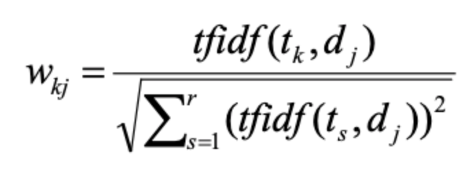
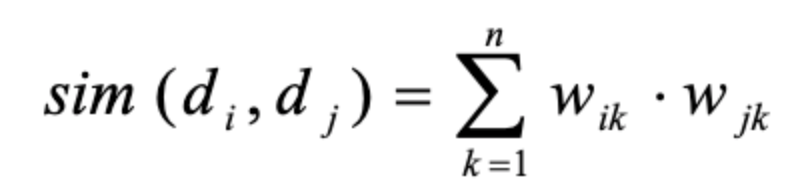
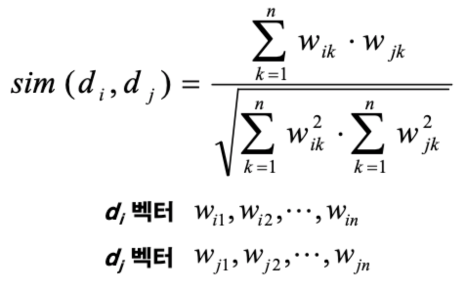
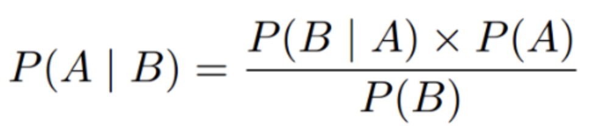

# introduction-to-artificial-intelligence-study
Introduction to Artificial Intelligence

## Text Categorization

- TFIDF: term weight
  - TF: term frequency in document
    - document 안에서 단어가 얼마나 나왔는지
    - doucument 에서 단어가 나온 빈도 수
  - IDF: inverted document frequency
    - 그 단어가 얼마나 document 사이에서 등장했는지
    - log2(n/df)
    - n: document 총 갯수
    - df: 단어가 나온 document 수
  - nomalization
    - 

## Similarity Measure Method

* 2가지 object 사이에 유사성을 측정하는 방법

* method
  1. inner product
    - 
  2. euclidean distance
    - 그냥 거리 구하는 공식
  3. cosine coefficient
   - 
  

## Dicision Tree

## KNN

* k nearest neighbor
* 근접한 k 개의 neighbor 를 찾아서 추측하는 방법

## The Naive Bayes

* Bayes 법칙을 기반으로 하는 학습 방법이다.
  - 
  - P(R| A1 && A2 && A3 ... AN) = P(A1|R) * P(A2|R) ... * P(AN|R) * P(A) / P(A1 && A2 && A3 ... && AN)

* Laplace smoothing
  - 빈도 수 없으면 확률 0 된다. => 모든 개수에 + 1 해서 계산

* 확률 곱이면 너무 작아지니 log 취한다